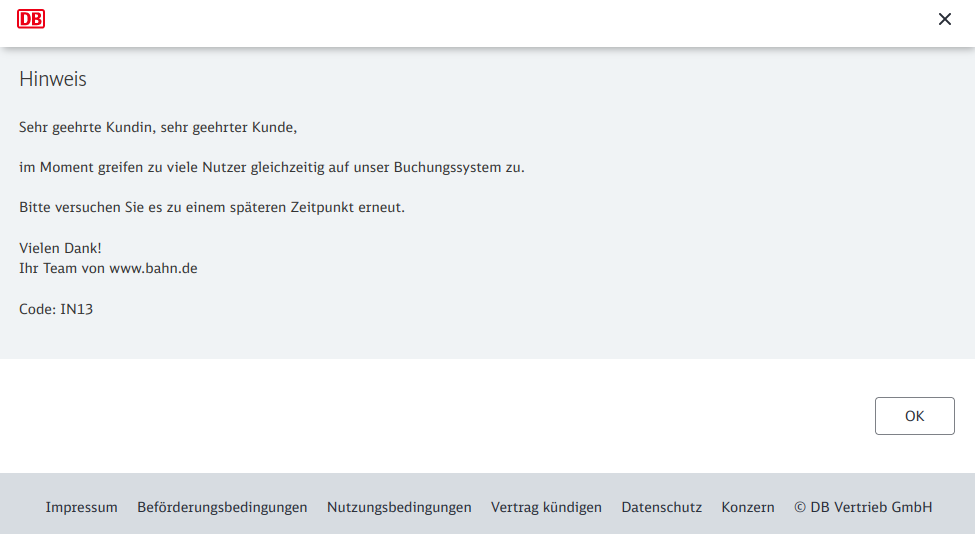

# Analyzing DB train prices

As I use the german train (DB) a lot when traveling in central europe I was wondering if there are any technics to find cheap tickets or how much in advance I should book my ticket.

## 1. Collecting Data

Since there is no public available data on train prices and the db api provides only information about the timetable but not about ticket prices, I had to scrape the data.

All scipts used for collecting the data can be found in [/final-project/scraping](https://github.com/emely3h/SE_25_Data_Science/tree/main/final_project/scraping).
I was happy to not get completely blocked while scraping, but some of my requests got blocked and an error page was returned frequently. Therefore I needed to add a few seconds of waiting time after a couple of requests which made scraping very time consuming which is why I only scraped prices for two different routes.

*Response when getting blocked when sending to many requests in at a time.*

The scraped data can be found in [/final-project/data](https://github.com/emely3h/SE_25_Data_Science/tree/main/final_project/data)

I scraped the train prices for the following <strong>routes</strong>:
- Berlin Hbf - Biberach (Riß)
- Berlin Hbf - Memmingen Hbf
- Memmingen Hbf - Berlin Hbf

For each route I scraped the train prices for the following input parameters. The character in the brackets represents the symbols used in the folder structure.

I scraped the train prices for 2 different <strong>age groups</strong>:
- Adult: 27 - 64 years old (A)
- Youth: 16 - 26 years old (Y)

For each age group I also scraped the prices seperately for different <strong>tariff classes</strong>:
- first class (1)
- second class (2)

In adition to the standard price (0) DB also offers different <strong>discount subscriptions (bahncard) </strong>:
- Bahncard 25, first class (1)
- Bahncard 25, second class (2)
- Bahncard 50, first class (3)
- Bahncard 50, second class (4)

The idea is that you pay once for the bahncard and then you get a 50 % or 25 % discount on all tickets.

For every route I created subfolders for every combination of input variables I used for scraping. 
Filestructure: /data/route/age_bahncard_tariffClass/day

E.g. file data/memmingen-berlin/E_0_1/11.11.2022.csv contains all train prices for the route memmingen-berlin on day 22.11.2022 (dd.mm.yyyy). The passanger would be an adult without a bahncard traveling in first class.

For all the combinations of different input variables I scraped the prices for 90 days in advance.

## 2. Data Cleaning

Functions for importing and cleaning data can be found in [utils.py](https://github.com/emely3h/SE_25_Data_Science/blob/main/final_project/utils.py)

After importing and cleaning a dataframe representing one day contains the following columns:

*Fig1: Data frame after importing and cleaning*

On top of the various input parameters we also have over 30 different [ticket types](https://www.bahn.de/angebot/sparpreis-flexpreis). I chose to focus on the for my traveling relevant ticket types:
- Sparpreis
- Super Sparpreis
- Flexpreis
- Flexpreis Plus
The main difference between the ticket types is  that the first two ticket types are bound to one route at a specific time. If you have a Flexpreis or Flexpreis Plus ticket you can take any train on the route at that day. Meaning if you have a ticket with departure time 4pm you could also take an earlier train or later train, you just have to stick to the route. More details about the different ticket types can be found [here](https://www.bahn.de/angebot/sparpreis-flexpreis).

## 3. Data Analysis/ Exploration

For the analysis I focused on 4 different questions:

- What is the best time of day to travel?
- What is the best day of the week to travel?
- How many days in advance should I book my ticket?
- Which route is cheaper, Berlin-Biberach or Berlin-Memmingen?

### 3.1 Best time of day to travel

To find the best time of day to travel, I first looked at scatterplots of individual days for different bahn cards, age groups and tariff classes. When grouping the the prices by ticket types I could always see the same pattern. In Fig1 you can find a representative example.

*Fig2: Ticket prices for the route Berlin Hbf- Memmingen ZOB, for an adult with a bahn card 25 traveling in first class on the 11.11.2022.*

Both the Flexpreis and Flexpreis Plus tickets have the same price throughout the day except for a connection at 22:29.  Sparpreis and Super Sparpreis tickets are the cheapest very early in the morning before 6:00 or late in the evening after 20:30.

This pattern applies to all connections, no mather which age group, bahncard or route we are looking at. 
To make sure that this also applies to all days I plotted prices grouped the days by weekday and plotted multiple days in one plot which confirmed the pattern I discovered.

### 3.2 Best day of week

If we want to find out what is the best day of week to travel we have to look separately at the Flexpreis and the Sparpreis tickets. The Flexpreis tickets follow a very clear pattern, again it does not matter if it is a Flexpreis or Flexpreis Plus ticket. It also applies to all age groups, routes and bahncards.Surprisingly the cheapest day is Saturday. The most expensive days are Sunday, Friday and Wednesday. Mondays and Tuesdays are a bit more expensive than Saturdays but far more cheap then the remaining days.

*Fig3: Mode price for each day, grouped by weekdays for the route Berlin-Biberach for an adult traveling with a bahncard 50 in first class with a Flexpreis ticket.

If we look a the Sparpreise and take the mean of each day we can see a similar pattern. However the time of day has a much bigger impact on the price than the day of week.

### 3.3 How many days in advance should I book my ticket?

My assumption in the beginning that a train is cheaper the earlier I book is not true. Fig shows, that Flexpreis and Flexpreis Plus tickets are very stable and it does not matter if you book one hour before or 2 months in advance. It is different for Sparpreis and Super Sparpreis tickets. The graph shows a small descend however it clearly shows that the day of week has a much bigger impact on the price than the amount of days you book in advance.

*Fig4: Mean price for each day, grouped by weekdays for the route Berlin-Biberach for an adult traveling with a bahncard 50 in first class with a Flexpreis ticket.

If you book a couple of weeks in advance some special ticket types like ‘Sparpreis 1.Kl’ that offer an relatively cheap upgrade to first class become available but second class ticket don’t get significantly cheaper.

### 3.4 Which route is cheaper?

To visit my family I have two different route options. Since both are about the same length and comfort, I would like to compare them in price.
The first route (Berlin-Biberach) goes via Mannheim, Stuttgart and Ulm, the second (Berlin-Memmingen) goes via Erfurt and Munich. Since I am under 27 years old and I have a bahncard 50 I compared the Flexpreis and Sparpreis tickets for both routes. The result is shown in fig

Fig5: Comparing price development  over 90 days for two different routes, Berlin- Biberach and Berlin- Memmingen. Passenger is an adult with a bahn card 50  traveling in second class

When booking Flexpreis tickets it is not worth comparing prices of both routes, the prices are almost identical. The prices for the Sparpreis tickes are also very similar, but sometimes differ slightly, whereby the route via Stuttgart can be up to 30 € cheaper.

## 4. Discussion & Takeaways

Main takeaways for booking train tickets with DB:
If you have to book a flexticket check if there is a cheaper one late in the evening
If you are not flexible about your time of travel and the Sparpreis or Super Sparpreis ticket is expensive always check if there is a cheaper Flexticket at the same day late in the evening.
Saturdays and Tuesdays are the cheapest travel days, Sundays and Fridays are the most expensive ones
The cheapest tickets are always the ones early in the morning
If you book a Sparpreis Ticket the time of day has a much bigger impact on the price than the day of week
Booking more than one week in advance is overrated.

I was surprised to find so many irregularities, e.g. Flexpreis tickets not having the same price throughout the day or being sometimes even cheaper than Sparpreis tickets. The main problem with finding the cheapest ticket is the way the website is designed. It makes it really hard to compare different tickets and different travel times which is why many people not book the cheapest/ best option.

The biggest weakness of my analysis is that I can't make a statement about how good and complete the data I have is. Since I was blocked from time to time while scrapping, it is very likely that a few connections are missing. This of course has an impact on the mean and mode, I used to observe the price development over a longer period of time.
There are also a lot of questions that have not been explored yet, like exploring further what time of day is the best for Sparpreis tickets/ how often does it occur that a Flexticket is better than a Sparpreis ticket/  Which bahncard is the best, depending on personal travel habits,...?

